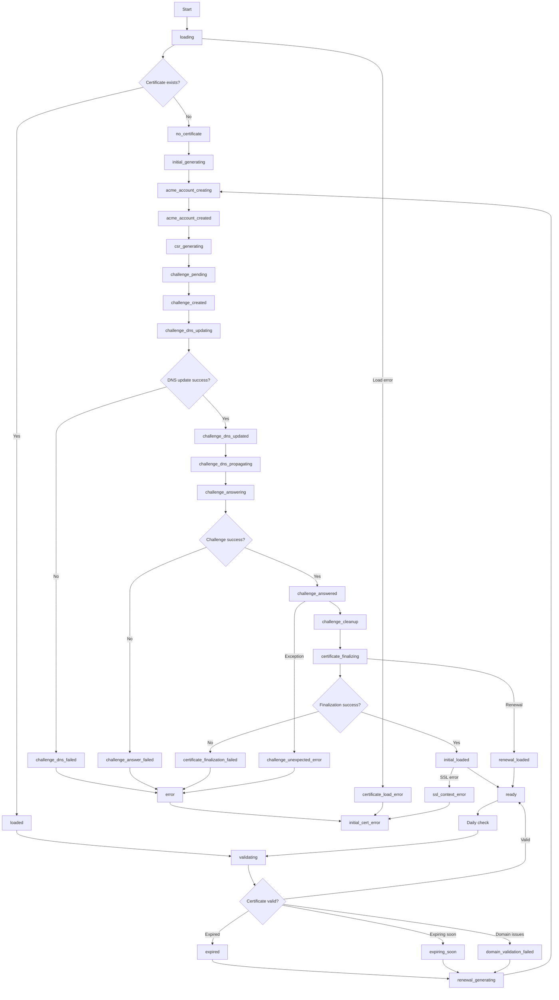

# Certificate status overview

The `CertificateStatus` enum in the hass-nabucasa library represents different states during the SSL/TLS certificate lifecycle for Home Assistant Cloud remote access. Each status indicates a specific phase in certificate creation, validation, renewal, or error handling.

## Certificate status definitions

### ACME account management

- **`acme_account_creating`**: Creating or loading ACME account with Let's Encrypt.
- **`acme_account_created`**: ACME account successfully created/loaded.

### Certificate generation

- **`generating`**: General certificate generation status.
- **`initial_generating`**: First-time certificate generation for new instances.
- **`renewal_generating`**: Certificate renewal generation process.
- **`csr_generating`**: Generating Certificate Signing Request (CSR).

### Challenge process (DNS-01)

- **`challenge_pending`**: Challenge request initiated with ACME server.
- **`challenge_created`**: Challenge tokens created and ready for DNS update.
- **`challenge_dns_updating`**: Updating DNS records with challenge tokens.
- **`challenge_dns_updated`**: DNS records successfully updated.
- **`challenge_dns_propagating`**: Waiting for DNS propagation (60 seconds).
- **`challenge_answering`**: Responding to ACME challenge.
- **`challenge_answered`**: Challenge successfully answered.
- **`challenge_cleanup`**: Cleaning up DNS challenge records.

### Certificate finalization

- **`certificate_finalizing`**: Finalizing certificate with ACME server.
- **`validating`**: Validating certificate requirements and expiration.

### Loading and status

- **`loading`**: Loading existing certificate from disk.
- **`loaded`**: Certificate successfully loaded from disk.
- **`initial_loaded`**: Initial certificate loaded and ready for first use.
- **`renewal_loaded`**: Renewed certificate loaded successfully.
- **`ready`**: Certificate is valid and system is ready for connections.

### Certificate states

- **`no_certificate`**: No certificate exists (needs generation).
- **`expired`**: Certificate has expired (needs renewal).
- **`expiring_soon`**: Certificate expires within 25 days (renewal recommended).

### Error states

- **`error`**: General certificate error.
- **`initial_cert_error`**: Error during initial certificate creation.
- **`renewal_failed`**: Certificate renewal failed.
- **`certificate_load_error`**: Error loading certificate from disk.
- **`ssl_context_error`**: Error creating SSL context (e.g., key mismatch).
- **`certificate_finalization_failed`**: Failed to finalize certificate with ACME.
- **`challenge_answer_failed`**: Challenge response failed.
- **`challenge_dns_failed`**: DNS update for challenge failed.
- **`challenge_unexpected_error`**: Unexpected error during challenge process.
- **`domain_validation_failed`**: Custom domain DNS configuration invalid.

## Certificate status flow

## Key transitions

1. **Initial certificate creation**: `loading` → `no_certificate` → `initial_generating` → ... → `ready`

2. **Certificate renewal**: `ready` → `validating` → `expiring_soon`/`expired` → `renewal_generating` → ... → `ready`

3. **Error recovery**: Various error states → `initial_cert_error` → retry or manual intervention

4. **Daily validation**: `ready` → `validating` → `ready` (if still valid)

The certificate system automatically handles renewal when certificates expire within 25 days and performs daily validation checks to ensure continued operation.